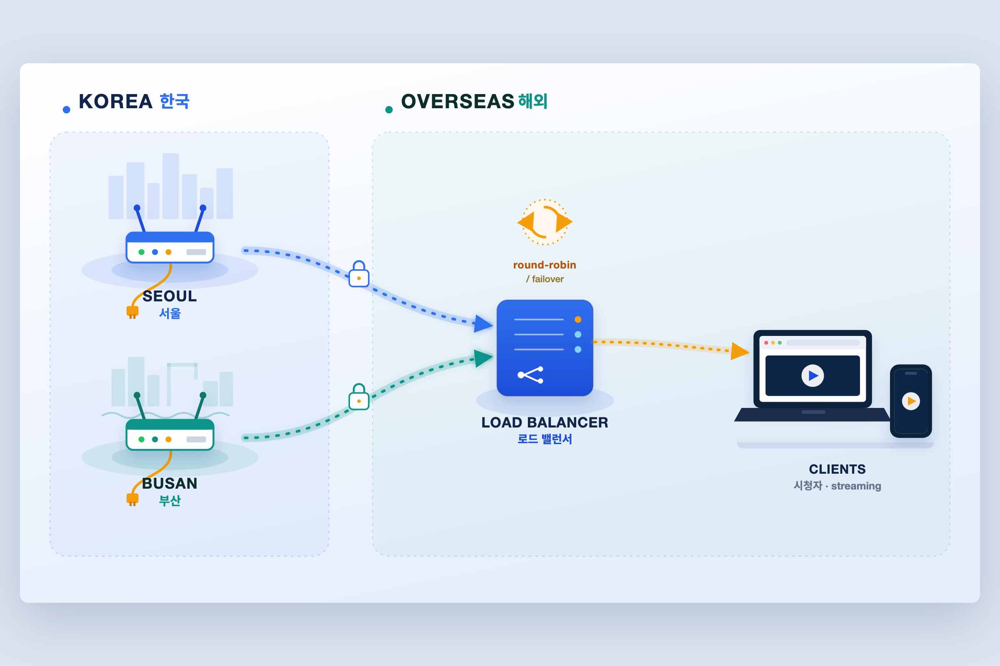

# tailnet-georoute



> ▶ **움직이는 다이어그램(라이브 데모):** GitHub Pages를 켜면 `https://taehyungalexkim.github.io/tailnet-georoute/` 에서 애니메이션으로 볼 수 있어요. (켜는 법은 맨 아래)

**한국에 둔 라우터 2대로, 해외에서 한국 서비스를 끊김 없이 보는 방법.**
[Tailscale](https://tailscale.com) 위에서 *원하는 서비스의 트래픽만* 골라 한국으로 보냅니다. 두 라우터를 번갈아 쓰다가(라운드로빈) 한쪽이 느려지거나 끊기면 자동으로 다른 쪽으로 넘어가요. 이미 가지고 있는 장비로, 매달 나가는 구독료 없이.

> 예시는 **치지직(해외에서 한국 라이브 방송 보기)**이지만, 방식 자체는 범용입니다. 지역이 잠긴 서비스 접속, 여러 지역에서의 테스트, 회선 이중화 어디에나 그대로 씁니다.

*(English summary at the bottom / 영문 요약은 맨 아래.)*

---

## 뭐가 좋은가

- **잘 안 막히는 "가정용" IP.** 지인이나 가족 집에 작은 라우터 하나 두면, 거기서 나가는 트래픽은 진짜 가정집 IP예요. 요즘 스트리밍 서비스는 상용 VPN이 쓰는 데이터센터 IP는 곧잘 막지만, 평범한 가정용 IP까지 막는 경우는 드뭅니다.
- **두 대라서 잘 안 끊긴다.** 서로 다른 통신사·다른 도시(예: 서울·부산)의 라우터 두 대를 동시에 씁니다. 한쪽 회선이 잠깐 출렁여도 몇 초 만에 다른 쪽으로 넘어가니 영상이 멈추지 않아요.
- **전부 말고, 필요한 것만.** Tailscale의 exit node는 기기 전체를 한 나라로 보내버리지만, 이 방식은 정해둔 서비스만 보냅니다. 나머지는 평소대로 직접 연결돼서 빠르고요.
- **추가 비용 0원.** Tailscale 무료 요금제와 이미 있는 라우터면 충분합니다.

### 다른 방법과 비교
| | 이 방식 | 상용 VPN | 단일 exit node |
|---|---|---|---|
| 나가는 IP | 가정용 ✅ | 데이터센터 ❌ | 노드 나름 |
| 두 회선 동시 사용 | ✅ 라운드로빈+페일오버 | ❌ | ❌ 한 번에 하나 |
| 골라서 우회 | ✅ 도메인 단위 | 일부 | ❌ 기기 전체 |
| 매달 비용 | 없음 | 유료 | 없음 |
| 난이도 | 중 | 하 | 하~중 |

---

## 준비물
- 한국(대상 국가)에 둘 **소형 라우터·미니 PC 2대.** 가능하면 통신사·지역이 서로 다른 게 좋아요. **GL.iNet GL-MT2500**(OpenWrt, aarch64)으로 검증했고, OpenWrt나 리눅스가 도는 장비면 대부분 됩니다.
- 모든 장비(라우터 2대 + 밸런서 + 내 기기)에 **Tailscale.**
- 밸런서를 돌릴 **항상 켜져 있는 장비**(NAS, 미니 PC 등) + Docker.
- 클라이언트용 크로미움 브라우저 + **Proxy SwitchyOmega(ZeroOmega)** 확장.

## 설치

### 1. 한국 라우터 2대 — SOCKS 프록시 깔기
각 라우터에 SSH로 들어가서, 그 라우터의 Tailscale IP를 넣고 스크립트를 돌리면 됩니다. `gost` SOCKS5 프록시를 깔고 부팅 때 자동으로 뜨게 만들어요.
```sh
# 라우터 A (예: 서울)
./scripts/setup-brume.sh 100.x.x.A 1080
# 라우터 B (예: 부산)
./scripts/setup-brume.sh 100.x.x.B 1080
```
Tailscale IP는 `tailscale status`로 확인하세요.

### 2. 밸런서 — 두 프록시를 묶기
```sh
cp balancer/docker-compose.yml.example balancer/docker-compose.yml
# <NODE_A_TSIP>, <NODE_B_TSIP> 채우고, 네트워크 모드 A/B 중 선택
docker compose -f balancer/docker-compose.yml up -d
```
호스트 자체가 Tailscale에 들어가 있으면 **모드 A**(보통 이 경우), Tailscale이 컨테이너로 돌고 있으면 **모드 B**(그 컨테이너의 네트워크를 공유). 자세한 설명은 파일 주석에 있습니다.

### 3. Tailscale ACL — 밸런서가 **태그된 노드**일 때만
밸런서의 Tailscale 노드에 태그(`tag:docker` 등)가 붙어 있으면, 기본 ACL이 라우터 접근을 막을 수 있어요. 증상이 좀 헷갈리는데 — **`tailscale ping`은 되는데 실제 통신(TCP)은 안 되면** 거의 이겁니다. 관리 콘솔에서 허용 한 줄 추가:
```json
{ "action": "accept", "src": ["tag:docker"], "dst": ["100.x.x.A:1080", "100.x.x.B:1080"] }
```

### 4. 브라우저 — 필요한 도메인만 보내기 (PAC)
**ZeroOmega** 설치 → New profile → **PAC Profile** → `client/proxy.pac.example` 내용 붙여넣기(`<BALANCER_IP>` 채워서) → Apply → 프로필 선택. 이때 Tailscale은 **켜두되 exit node는 None**으로 둡니다.

## 잘 되는지 확인
```sh
# 클라이언트에서: 두 IP가 번갈아 나오면 두 대를 동시에 쓰고 있는 거예요
for i in 1 2 3 4; do curl -fsS --socks5-hostname <BALANCER_IP>:1080 https://api.ipify.org; echo; done
```
서비스를 켠 채로 밸런서 로그(`docker logs gost-lb`)를 보면 어떤 도메인이 어느 라우터로 가는지 다 찍혀서, 제대로 분산되는지 눈으로 확인할 수 있습니다.

## 잘 안 될 때
- **켜자마자 `Connection refused`** — gost가 아직 다 안 떠서 그래요. `... on <ip>:1080` 로그가 뜬 뒤 다시 시도.
- **밸런서에서 `none node available` / `i/o timeout`** — 십중팔구 위 3번 ACL 문제. ping은 되는데 통신이 안 되면 ACL을 의심하세요.
- **클라이언트에서 타임아웃** — 내 기기의 Tailscale이 꺼졌거나 exit node가 잡혀 있어요. 켜고, exit node는 None.
- **페이지는 뜨는데 영상만 안 나옴** — 영상 CDN 도메인이 PAC에서 빠진 경우. F12 → Network에서 그 도메인을 찾아 PAC에 추가.
- **라우터 펌웨어 업데이트 후 gost가 사라짐** — GL.iNet은 펌웨어 갱신 때 지워질 수 있어요. `setup-brume.sh`를 다시 실행하세요.

## 라이브 데모(애니메이션) 띄우기 — GitHub Pages
저장소 **Settings → Pages → Source**를 `main` 브랜치 / 루트(`/`)로 지정하면, 몇 분 뒤 `https://taehyungalexkim.github.io/tailnet-georoute/` 에서 `index.html`(움직이는 다이어그램)이 열립니다.

## ⚠️ 면책
이 프로젝트는 **본인 소유** 장비로 **본인** 트래픽을 우회시키는 네트워크 구성입니다. 지역 제한 우회는 서비스의 이용약관이나 콘텐츠 라이선스에 어긋날 수 있어요. 관련 법과 약관을 지킬 책임은 사용자에게 있습니다. 교육 목적의 "있는 그대로(as-is)" 제공이며, 어떤 보증이나 지원도 약속하지 않습니다.

---

## English (summary)

**Watch a geo-locked service smoothly from abroad, using two routers you place in the target country.** Over [Tailscale](https://tailscale.com), only the chosen service's traffic is routed home; the two routers are used round-robin with automatic failover. Everything else stays direct. No subscription.

**Why:** residential exit IPs (rarely blocked, unlike datacenter VPN IPs) · two ISPs/cities used at once for resilience · selective per-domain routing (not whole-device) · reuses free Tailscale + hardware you own.

**Setup:** (1) run `scripts/setup-brume.sh <tailscale-ip>` on each router to install a `gost` SOCKS5 proxy; (2) run the `balancer/docker-compose.yml` (gost round-robin + failover); (3) if your balancer node is *tagged*, add a Tailscale ACL accept rule (symptom of the missing rule: `tailscale ping` works but TCP doesn't); (4) point a browser PAC (`client/proxy.pac.example`) at the balancer. Keep Tailscale on with exit node = None. See the Korean sections above for details and troubleshooting.

**Disclaimer:** A networking pattern for routing **your own** traffic over infrastructure **you control**. Bypassing geo-restrictions may violate a service's Terms of Service and content licensing — you are responsible for compliance. Provided **as-is**, for educational purposes, no warranty, no support.

## License
MIT — see [LICENSE](LICENSE).
